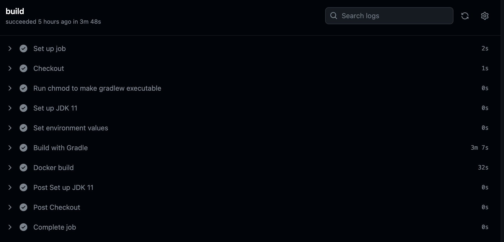

### 픽스처 몽키

https://github.com/naver/fixture-monkey

테스트 픽스처를 자동으로 만들어주는 라이브러리다.


## 테스트에 대한 이야기

현재 우리 팀에서는 운영서버에 대한 CI/CD 파이프라인을 구축하여 사용하고 있다. 하지만, 개발서버의 경우 cross domain의 쿠키 전송 정책 때문에 사용하지 못하고 있었고, 매번 JAR 파일을 프론트엔드로 넘겨줘야 하는 일이 반복되었다. 최근에 해당 이슈를 해결하게 되어 드디어 개발서버에도 CI/CD를 구축할 수 있게 되었다! 그동안 CI/CD 관련 경험이 없어 꽤 아쉬웠는데 이번 기회에 시도해볼 수 있어 좋은 경험이 되었던 것 같다.

한편 개발서버에 CI/CD를 구축하게 된 배경에는 테스트 검증 프로세스를 자동화시키기 위함도 있다. 기존 레거시에서는 꽤 오랫동안 테스트가 방치되어 있었고, 앞으로의 계획이 레거시 리팩토링인만큼 2~3회의 스프린트를 거치면서 통합 테스트 작성을 통해 전체적인 테스트 커버리지를 올리려고 한다. 테스트가 실패한다면? CI/CD도 실패한다.

개인적으로는 이렇게 테스트를 강제하는 것이 테스트의 신 박재성님이 강조하시는 '테스트는 개발주기 안에 통합되어 있어야 한다' 라는 금언을 실현하는 데 도움이 된다고 생각한다. 최근에 테스트에 대해서 이야기를 나눌 기회가 생겼는데, '핵심적인 비즈니스 로직에 대한 단위 테스트가 중요하고, 통합 테스트는 QA 과정에서 검수가 이루어지기 때문에 우선순위가 낮은 것 같다' 라고 말하는 걸 들었다고 한다. 일정이 타이트한 상황에서는 어느 정도 맞는 말일 수도 있지만, 그것이 '통합 테스트를 작성하지 않아도 되는' 이유가 되지는 않는다. 즉, 극히 예외적인 상황을 제외하면 허용되어야 한다고 생각하지 않는다.

몇몇 큰 회사들 중에서도 일부는 테스트를 작성하지 않는다고 들었다. 누구나 이름을 들어봤을법 한 회사인데도 그렇다더라. 그 팀의 테크 리드는 어떤 이유를 들 것인가? 스타트업 씬에서, 빅테크 기업에게 기대하는 코드 퀄리티나 테스트 프로세스를 기대하면 안되는 것은 맞다. 짧은 주기로 기능이 없어지고 생기는 곳에서, 회귀 방지를 위해 그 코드를 테스트로 꽁꽁 감싸봤자 그 코드 덩어리째로 폐기되는 일들이 비일비재한데, 당연히 테스트 작성에 드는 trade-off를 고려해야 하지 않겠는가.

테스트 환경을 구축하고, 테스트 작성 자체에 대해 고민하고, 그 과정에서 드는 코스트로 인해 팀 퍼포먼스가 저하되고, 이런 이유들은 전부 '팀이 테스트 작성에 익숙하지 않기 때문에' 발생한다. 그렇다면 팀이 테스트 작성에 익숙하지 않으니 영원히 테스트를 작성하지 않을 것인가? 그게 과연 올바른 일일까?

영원히 그 상태로 있는다면 영원히 익숙해질 수 없다. 언젠가 코드는 말썽을 일으킬 것이고, 리팩토링은 망설여질 것이고, 복잡한 구현은 후임자에게 '건드려서는 안되는 레거시'로 남을 것이다. 때로는 과감한 전환 혹은 약간의 강제성이 필요하다. Spring REST Docs를 도입하면서 컬리 기술 블로그의 글을 보게 되었다. Spring REST Docs의 핵심은 무엇인가? 테스트를 강제한다는 것이다. 테스트를 통과해야만 문서화될 수 있고, 그제서야 비로소 다른 개발자, 다른 팀과 공유될 수 있다. 테스트를 올바르게 작성해야 한다는 전제가 붙긴 하지만, 이렇게 만들어진 문서는 '분명 작동할 것이라는' 신뢰감과 자신감을 준다. 이 감정은 테스트를 작성해보지 않은 사람은 알 수 없는 부류의 것이다.

결국 테스트 작성같은 '근본력'과 관련된 부분에서는 '진짜 잘하는 집을 안 가봐서 그래' 라는 마인드를 가지는 것이 중요하다. 테스트 때문에 기능 개발이 느려진다고? 듀를 맞추지 못하겠다고? 그건 아직 팀이 테스트에 익숙하지 않기 때문이다. 테스트에 익숙한 팀은 '개발 주기 안에 테스트가 통합되어 있기 때문에' 더 빠르게 개발할 수 있다. 


## Github Actions를 활용한 Gradle 빌드 캐싱 전략

### 로컬 환경에서의 Gradle 빌드

Github Actions를 사용하여 CI/CD 파이프라인을 구축했다. 문제가 하나 있는데, 바로 워크플로우를 실행하는 데 너무 오랜 시간이 걸린다는 것이다. 짧게는 3분 초반부터, 길게는 4분까지 걸렸다.



예상했겠지만 대부분의 시간을 빌드에서 잡아먹고 있었다. 사실 로컬 환경에서 빌드할 때는 이렇게 오래 걸리지 않는다. 이전에 빌드한 결과를 캐시하여 `.gradle`이나 `build`에 저장해두기 때문이다. 동일한 build 작업을 연속해서 실행했을 때, 특정한 작업 단계에 대하여 변경사항이 없다면 Gradle은 해당 작업 단계를 스킵한다.

먼저 클린 빌드를 한 경우를 보자. 일부 로그는 생략하겠다.

```
> Task :initQuerydslSourcesDir
> Task :compileQuerydsl
> Task :compileJava
> Task :processResources
> Task :classes
> Task :bootJarMainClassName
> Task :bootJar
> Task :jar SKIPPED
> Task :assemble
> Task :editorconfigCheck
> Task :compileTestJava
> Task :processTestResources NO-SOURCE
> Task :testClasses
> Task :test
> Task :check
> Task :openapi3
> Task :build

BUILD SUCCESSFUL in 21s
10 actionable tasks: 10 executed
```

빌드에는 총 21초가 소요되었다. 10개의 actionable task 중 10개를 모두 실행했다고 한다.


위의 Task 로그를 실제로 세어보면 17개다. 근데 10개밖에 없다고? 약간 헷갈릴 수도 있다.
이는 Gradle Task가 Actionable Task와 Lifecycle Task로 구분되기 때문이다. 

Actionable Task는 실제로 뭔가 실행되는 작업이고, Lifecycle Task는 다른 작업을 주렁주렁 달고 있는 연결고리 작업으로서 그 자체로는 아무 것도 하지 않는다고 생각하면 된다. 자세한 설명은 다른 글을 참고하시라. 


```
> Task :initQuerydslSourcesDir
> Task :compileQuerydsl UP-TO-DATE
> Task :compileJava UP-TO-DATE
> Task :processResources UP-TO-DATE
> Task :classes UP-TO-DATE
> Task :bootJarMainClassName UP-TO-DATE
> Task :bootJar UP-TO-DATE
> Task :jar SKIPPED
> Task :assemble UP-TO-DATE
> Task :editorconfigCheck
> Task :compileTestJava UP-TO-DATE
> Task :processTestResources NO-SOURCE
> Task :testClasses UP-TO-DATE
> Task :test UP-TO-DATE
> Task :check
> Task :openapi3
> Task :build

BUILD SUCCESSFUL in 4s
10 actionable tasks: 3 executed, 7 up-to-date
6:32:33 PM: Execution finished 'build'.
```

이번에는 위 상태에서 한 번 더 빌드를 실행한 로그이다.

일단 빌드하는 데 4초밖에 안 걸렸다.

그것도 좋지만, 위 로그와 비교해보면 `UP-TO-DATE`가 새로 붙은 것을 알 수 있다. 이게 뭐냐? 일단 마지막 부분을 보자. 

10개의 actionable task 중 3개는 실행되었고, 7개는 `UP-TO-DATE` 라고 한다. 

이 `UP-TO-DATE`는 '최신 변경사항을 이미 반영하여 굳이 실행할 필요가 없는' 작업이라는 의미다.

구체적으로 어떻게? 뻔하다. 바뀐 게 없으면 그냥 별다른 작업을 수행하지 않는 것이다. 만약 뭔가 결과물을 내보내야 하는 작업이라면 그 결과를 캐시하여 저장한다. 대표적인 것이 저 `compileQuerydsl` 이다. 저걸 실행하면 우리에게 익숙한 QClass들이 마구마구 생긴다. 근데 엔티티 코드에 변화가 없다면 굳이 저 QClass를 처음부터 다시 만들어야 할까? 굳이? 당연히 캐시해놨다가 변경이 발생할 때 다시 만들어주면 좋을 것이다.

이는 Gradle의 점진적 빌드(incremental build)와 빌드 캐시 덕분이다. 변경이 발생하지 않았다면 굳이 작업을 실행하지 않으며, 이미 실행된 결과의 경우 `.gradle` 등의 디렉토리에 캐시로 저장해놨다가 재사용한다. 이는 빌드 속도를 향상시키는데 도움이 된다.


### Github Actions 환경에서의 Gradle 빌드

Github Actions의 경우 가상 환경 인스턴스에서 각 작업들을 실행하는 방식이다. 특정 브랜치의 프로젝트 파일을 가져오고, JDK 환경을 설정하고, 환경 변수도 설정해주고, 도커로 말아주고, 도커허브에 푸시해주는 과정을 자동화한다. 단 이 가상 환경 인스턴스의 경우 깃허브의 컴퓨팅 소스 및 다양한 리소스를 빨아먹기 때문에 아주 큰 프로젝트를 아주 오랫동안 올려놓고 무거운 작업을 돌린다면 깃허브를 인수한 마소 사장님이 슬퍼할 것이기 때문에, 용량과 사용 시간에 따라 비용 청구가 될 수도 있다. 물론 대부분의 경우 무료로 사용할 수 있다.

당연히 하나의 워크플로우가 끝나면 이 가상 환경도 초기화된다. 워크플로우가 실행될 때만 자원이 제공되는 식이다. 그럼 문제가 뭐냐? 우리가 로컬 환경에서 누리고 있었던 Gradle의 편리한 점진적 빌드, 빌드 캐시같은 장점을 더 이상 누릴 수가 없게 되는 것이다. 규모가 있는 프로젝트를 해본 사람이라면 클린 빌드를 돌리는 동안 커피 한 잔 내리고... 화장실도 갔다오고... 카톡도 좀 보고... 합법적 휴식을 누릴 수 있다는 것쯤은 알 것이다. 근데 그 클린 빌드를 매번 해야 한다니 참 문제 아닌가?

다행히 깃허브에서는 워크플로우에 대한 캐시를 저장할 수 있다. 레포지터리 당 10기가로 꽤 넉넉한 편이고, 용량을 초과하면 오래된 캐시부터 지워주기도 한다. 그럼 이 캐시를 어떻게 사용할 수 있을까? Github Marketplace에서는 JDK 설정 등 번거로운 workflow를 직접 작성할 필요 없이 미리 만들어둔 action을 제공한다. 이 액션을 활용하여 워크플로우 캐시를 사용할 수 있다.

일단, 스프링 애플리케이션을 Gradle을 사용하여 배포한다고 가정하자. 이때, 캐시를 사용할 수 있는 세 가지 방법이 존재한다.


1. `cache` Action을 사용하는 방법
2. `setup-java` Action의 `cache` usage를 사용하는 방법
3. `gradle-build-action`을 사용하는 방법


인터넷에서 Github Actions에서 캐시를 사용하는 방법을 검색하면 대부분 1번이 나온다. 2번과 3번에 대해 다루는 한글 아티클은 본 적이 없었다. 이 글을 쓰게 된 이유도 바로 나머지 두 방법을 소개하고, 장단을 비교하기 위함이다.

사실 1번과 2번은 본질적으로 동일한 작업을 수행한다. 

하지만 3번의 경우 잘 알려지지 않은 방법이지만, 캐싱 뿐만이 아니라 유용하게 사용할 수 있는 다양한 기능을 제공한다. 이 역시 소개하고자 한다. 이걸 어떻게 알았냐면 Gradle 공식문서에서 '님들 혹시 아직도 1번 2번같은 방식 쓰고 있음? 이거 진짜 개좋은데 한번 츄라이 해보실?' 하고 있길래 가져왔다. 공식 문서 꼭 보자. 

또한, 번외로 `--no-daemon` 에 대해서도 간단하게 언급하면서 글을 마치도록 하겠다.

### Gradle 빌드 시 `--no-daemon`의 역할
github actions 예제에서는 daemon을 비활성화하는 예제를 보여주고 있다. 문제가 하나 있

https://blog.gradle.org/gh-actions