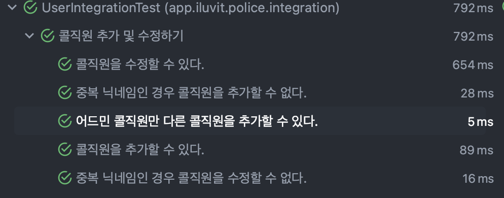

## 테스트 최적화

대개 테스트 환경 간 격리를 위해 DirtiesContext를 사용한다. 하지만 이는 테스트 시 스프링의 컨텍스트 캐싱을 막으므로 좋은 방법이 아니다. 이를 해결하기 위해 다른 글들에서는 DirtiesContext를 제거하고, 데이터베이스를 cleanup해주는 전처리 메서드를 작성해주고 있다.

손너잘님의 글에서는 아래와 같은 방식을 채택하고 있다.

```java
@Component
@ActiveProfiles("test")
public class DatabaseCleaner implements InitializingBean {

    @PersistenceContext
    private EntityManager entityManager;

    private List<String> tableNames;

    @Override
    public void afterPropertiesSet() {
        entityManager.unwrap(Session.class)
                .doWork(this::extractTableNames);
    }

    private void extractTableNames(Connection conn) throws SQLException {
        List<String> tableNames = new ArrayList<>();

        ResultSet tables = conn
                .getMetaData()
                .getTables(conn.getCatalog(), null, "%", new String[]{"TABLE"});

        while(tables.next()) {
            tableNames.add(tables.getString("table_name"));
        }

        this.tableNames = tableNames;
    }

    public void execute() {
        entityManager.unwrap(Session.class)
                .doWork(this::cleanUpDatabase);
    }

    private void cleanUpDatabase(Connection conn) throws SQLException {
        Statement statement = conn.createStatement();
        statement.executeUpdate("SET REFERENTIAL_INTEGRITY FALSE");

        for (String tableName : tableNames) {
            statement.executeUpdate("TRUNCATE TABLE " + tableName);
            statement.executeUpdate("ALTER TABLE " + tableName + " ALTER COLUMN id RESTART WITH 1");
        }

        statement.executeUpdate("SET REFERENTIAL_INTEGRITY TRUE");
    }
}
```

막 복잡한 건 아니다.
핵심은 잠깐 참조 무결성 제약조건을 껐다가 테이블의 모든 로우를 제거하고 / 컬럼의 PK 시작 값을 1로 초기화하는 것이다.

하지만 이 코드는 PK 생성전략이 IDENTITY를 사용한다고 가정한다. 즉 테이블의 auto_increment 값을 1로 초기화한다는 것.

또 더욱 극악무도한 것은 모든 pk 컬럼명이 id라고 가정한다는 것이다. 우리의 레거시는 어떤 pk 컬렴명은 order_id 같이 테이블 이름이 앞에 붙는 것도 있고, 그냥 id로 붙는 것도 있어 다루기 어렵다.

심지어 기존 레거시는 시퀀스 전략을 사용하는 것도 있고, 최근 개발된 도메인은 identity 전략을 사용하는 것도 있고, 또 auto 전략을 통해 시퀀스 전략으로 매핑되는 경우도 있어 테이블 초기화가 매우 까다로웠다.

그래서 문제가 뭐냐?

1. 어떤 테이블의 pk 컬럼은 `id`이고 어떤 테이블은 `table_id`와 같이 되어있을 때, 어떻게 pk 컬럼을 찾아서 초기화할 것인가?

2. 어떤 테이블은 IDENTITY, 어떤 테이블은 SEQUENCE, 어떤 테이블은 AUTO를 사용하고 있다면, 어떻게 auto_increment를 사용하는 테이블만 찾아서 pk 칼럼을 초기화해줄 것인가? 그리고 시퀀스 전략에서는 pk 값을 어떻게 초기화해줄 것인가?

### pk 컬럼 이름 찾기

먼저 테이블을 찾는다.

```java
private static ResultSet extractTables(Connection connection) throws SQLException {
    return connection
        .getMetaData()
        .getTables(connection.getCatalog(), null, "%", new String[] {"TABLE"});
}
```

그리고 그 테이블의 이름으로 PK 칼럼을 찾는다.


```java
private static ResultSet extractPkColumns(Connection connection, String tableName) throws SQLException {
    return connection
        .getMetaData()
        .getPrimaryKeys(connection.getCatalog(), null, tableName);
}
```

### identity와 sequence를 어떻게 초기화할 것인가?

먼저 시퀀스 전략은 다음 SQL 문으로 간단히 초기화할 수 있다.

```sql
ALTER SEQUENCE HIBERNATE_SEQUENCE RESTART WITH 1
```

IDENTITY 전략, 즉 auto_increment 테이블은 다음과 같이 초기화한다.

```java
em.createNativeQuery(
    "ALTER TABLE " + 
    tableName + 
    " ALTER COLUMN " + 
    pkColumnName + 
    " RESTART WITH 1"
).executeUpdate();
```

### identity와 sequence를 어떻게 구별할 것인가?

`isAutoIncrement` 메서드를 쓰면 된다.

```java
private boolean isIdentityColumn(Connection connection, String tableName, String pkColumnName) throws SQLException {
    try (PreparedStatement ps = connection.prepareStatement(
        "SELECT " + pkColumnName + " FROM " + tableName + " WHERE 1=0")) {
        ResultSetMetaData rsMetaData = ps.getMetaData();
        return rsMetaData.isAutoIncrement(1);
    }
}
```

`WHERE 1=0` 은 어떤 데이터도 선택하지 않기 위해 존재한다.
그리고 PK 컬럼만 select 해서 해당 쿼리 결과의 메타데이터를 뽑아온다.
그리고 `isAutoIncrement(1)`로 첫번째 컬럼, 즉 PK 컬럼이 auto_increment인지 확인한다.


### (테이블, PK 컬럼명) 쌍 만들기

```java
	private void generateTableInfos(Connection connection) throws SQLException {
		Map<String, String> result = new HashMap<>();

        // 전체 테이블을 뽑아온다.
		ResultSet tables = extractTables(connection);

		while (tables.next()) {
            // 현재 테이블의 이름을 뽑아온다.
			String tableName = tables.getString("TABLE_NAME");

            // 현재 테이블의 PK 컬럼 목록을 뽑아온다.
			ResultSet pkColumns = extractPkColumns(connection, tableName);

			while (pkColumns.next()) {
                // 현재 PK 컬럼명을 뽑아온다.
				String pkColumnName = pkColumns.getString("COLUMN_NAME");

                // 뽑아온 PK 컬럼이 auto_increment인지 확인한다.
				if (isIdentityColumn(connection, tableName, pkColumnName)) {
                    // 맞으면 맵에 넣는다.
					result.put(tableName, pkColumnName);
				}
			}
		}

		this.tableInfos = result;
	}
```

나중에 beforeeach로 실행할 코드다.

```java
public void execute() {
    em.clear();
    em.flush();
    em.createNativeQuery("SET REFERENTIAL_INTEGRITY FALSE").executeUpdate();

    cleanIdentityTables();
    cleanSequenceTables();

    em.createNativeQuery("SET REFERENTIAL_INTEGRITY TRUE").executeUpdate();
}
```

각 clean 메서드의 구현은 다음과 같다.

```java
private void cleanIdentityTables() {
    identityTableInfos.forEach((tableName, pkColumnName) -> {
        em.createNativeQuery("TRUNCATE TABLE " + tableName).executeUpdate();
        em.createNativeQuery("ALTER TABLE " + tableName + " ALTER COLUMN " + pkColumnName + " RESTART WITH 1")
            .executeUpdate();
    });
}

private void cleanSequenceTables() {
    em.createNativeQuery("ALTER SEQUENCE HIBERNATE_SEQUENCE RESTART WITH 1").executeUpdate();
}
```

끝! 엄청 빠르게 돌아간다.




### 레퍼런스

https://bperhaps.tistory.com/entry/%ED%85%8C%EC%8A%A4%ED%8A%B8-%EC%BD%94%EB%93%9C-%EC%B5%9C%EC%A0%81%ED%99%94-%EC%97%AC%ED%96%89%EA%B8%B0-2
https://newwisdom.tistory.com/95
